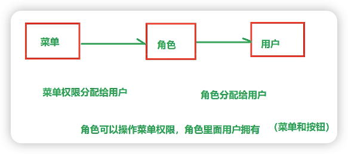
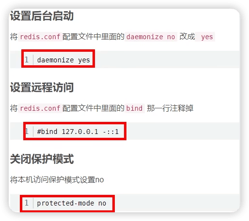

通用权限项目
-----

https://www.bilibili.com/video/BV1ad4y1y7LU

硅谷通用权限系统演示地址：http://139.198.152.148:8810/

http://localhost:8800/doc.html

system-front前端项目目录下：

```
npm run dev
```


## 一、搭建环境

### 1 项目介绍

权限管理是所有后台系统都会涉及的一个重要组成部分，而权限管理的核心流程是相似的，如果每个后台单独开发一套权限管理系统，就是重复造轮子，是人力的极大浪费，本项目就是针对这个问题，提供了一套通用的权限解决方案。

用户管理

角色管理

菜单管理

部门管理

岗位管理

日志管理

#### 核心技术

项目服务器端架构：SpringBoot + MyBatisPlus + SpringSecurity

前端架构：Node.js + Npm + Vue + ElementUI + Axios

| 基础框架：SpringBoot                              |
| ------------------------------------------------- |
| 数据缓存：Redis                                   |
| 数据库：Mysql                                     |
| 权限控制：SpringSecurity                          |
| 全局日志记录：AOP                                 |
| 前端模板：vue-admin-template                      |
| 前端技术：Node.js + Npm + Vue + ElementUI + Axios |

#### 项目模块

服务端架构

```
arauth-parent：根目录，管理子模块：  # 父工程 pom类型。依赖管理
    common：公共类父模块
        common-log：系统操作日志模块
        common-util：核心工具类
        service-util：service模块工具类
        spring-security：spring-security业务模块
    model：实体类模块
    service-system：系统权限模块
```

前端：arauth-frontend

#### 数据库设计


### 2 搭建环境

搭建各个模块


### 3 Mybatis-Plus

```xml
<dependency>
    <groupId>com.baomidou</groupId>
    <artifactId>mybatis-plus-boot-starter</artifactId>
    <version>3.4.1</version>
</dependency>
```


#### MP入门

##### 1-准备

- 配置文件
- 启动类

启动类中添加 `@MapperScan` 注解，扫描 Mapper 文件夹

- 实体类

实体类注解详细文档：https://baomidou.com/pages/223848/

@TableName：表名注解，标识实体类对应的表

@TableId：主键注解，type = IdType.AUTO（数据库 ID 自增）

@TableField：字段注解（非主键）

@TableLogic：逻辑删除

##### 2-创建mapper

mp实现curd操作
- 创建mapper的interface
- mapper继承BaseMapper<实体类>
- 调用mapper封装的实现实现curd操作

##### 3-创建service

- 创建service接口继承IService
- 创建service实现类，继承ServiceImpl


#### MP条件构造器


Wrapper ： 条件构造抽象类，最顶端父类

  AbstractWrapper ： 用于查询条件封装，生成 sql 的 where 条件

​    QueryWrapper ： Entity 对象封装操作类，不是用lambda语法

​    UpdateWrapper ： Update 条件封装，用于Entity对象更新操作

  AbstractLambdaWrapper ： Lambda 语法使用 Wrapper统一处理解析 lambda 获取 column。

​    LambdaQueryWrapper ：看名称也能明白就是用于Lambda语法使用的查询Wrapper

​    LambdaUpdateWrapper ： Lambda 更新封装Wrapper


#### MP封装service层

MP也替我们，把Service调用mapper过程 封装了

```java
@Service
public class SysRoleServiceImpl extends ServiceImpl<SysRoleMapper, SysRole> implements SysRoleService {
}

```

```java
public class ServiceImpl<M extends BaseMapper<T>, T> implements IService<T> {
    protected Log log = LogFactory.getLog(this.getClass());
    @Autowired
    protected M baseMapper;
```


> 


## 二、角色管理

### 1 测试controller层


### 2 整合Swagger2

[knife4j](https://doc.xiaominfo.com/)是为Java MVC框架集成Swagger生成Api文档的增强解决方案。

knife4j属于service模块公共资源，因此我们集成到service-uitl模块


```xml
<dependency>
    <groupId>com.github.xiaoymin</groupId>
    <artifactId>knife4j-spring-boot-starter</artifactId>
</dependency>
```

配置类：


knife4j测试路径 http://localhost:8800/doc.html

### 3 定义统一返回结果对象

common-util模块


### 4 条件分页查询

操作模块：service-uitl，service公共资源

1. 配置分页插件，通过配置类实现

```java
@EnableTransactionManagement
@Configuration
@MapperScan("com.andyron.system.mapper")
public class MybatisPlusConfig {

    /**
     * 分页插件
     */
    @Bean
    public MybatisPlusInterceptor ddPaginationInnerInterceptor(){
        MybatisPlusInterceptor interceptor = new MybatisPlusInterceptor();
        // 向Mybatis过滤器链中添加分页拦截器
        interceptor.addInnerInterceptor(new PaginationInnerInterceptor(DbType.MYSQL));
        return interceptor;
    }
}
```

2. 创建controller方法

```java
    @ApiOperation(value = "条件分页查询")
    @GetMapping("/{page}/{limit}")
    public Result findPageQueryRole(
            @ApiParam(name = "page", value = "当前页码", required = true)
            @PathVariable Long page,
            @ApiParam(name = "limit", value = "每页记录数", required = true)
            @PathVariable Long limit,
            @ApiParam(name = "roleQueryVo", value = "查询对象", required = false)
            SysRoleQueryVo sysRoleQueryVo) {

        Page<SysRole> pageParam = new Page<>(page, limit);
        IPage<SysRole> pageModel = sysRoleService.selectPage(pageParam, sysRoleQueryVo);
        return Result.ok(pageModel);
    }
```


3. Service方法

```java
    IPage<SysRole> selectPage(Page<SysRole> pageParam, SysRoleQueryVo sysRoleQueryVo);
```

```java
    @Override
    public IPage<SysRole> selectPage(Page<SysRole> pageParam, SysRoleQueryVo sysRoleQueryVo) {
        IPage<SysRole> pageModel = baseMapper.selectPage(pageParam, sysRoleQueryVo);
        return pageModel;
    }
```


4. mapper方法

```java
    IPage<SysRole> selectPage(Page<SysRole> pageParam, @Param("vo") SysRoleQueryVo sysRoleQueryVo);

```


5. 创建mapper的xml配置文件，编写sql语句实现

在resources目录下创建mapper/SysRoleMapper.xml文件

说明：分页我们统一定义到xml文件中，更方便直观

```xml
<?xml version="1.0" encoding="UTF-8" ?>
<!DOCTYPE mapper
        PUBLIC "-//mybatis.org//DTD Mapper 3.0//EN"
        "http://mybatis.org/dtd/mybatis-3-mapper.dtd">

<mapper namespace="com.andyron.system.mapper.SysRoleMapper">

    <resultMap id="RoleMap" type="com.andyron.model.system.SysRole" autoMapping="true">
    </resultMap>


    <select id="selectPage" resultMap="RoleMap">
        select <include refid="columns" />
        from sys_role
        <where>
            <if test="vo.roleName != null and vo.roleName != ''">
                and role_name like CONCAT('%',#{vo.roleName},'%')
            </if>
            and is_deleted = 0
        </where>
        order by id desc
    </select>

</mapper>
```


### 5 统一异常处理

service-util

#### 全局异常处理


#### 特定异常处理


#### 自定义异常处理


## 三、前端基础知识

### 前端开发介绍

前端工程师“Front-End-Developer”源自于美国。大约从2005年开始正式的前端工程师角色被行业所认可，到了2010年，互联网开始全面进入移动时代，前端开发的工作越来越重要。

最初所有的开发工作都是由后端工程师完成的，随着业务越来越繁杂，工作量变大，于是我们将项目中的可视化部分和一部分交互功能的开发工作剥离出来，形成了前端开发。

由于互联网行业的急速发展，导致了在不同的国家，有着截然不同的分工体制。

在日本和一些人口比较稀疏的国家，例如加拿大、澳大利亚等，流行“Full-Stack Engineer”，也就是我们通常所说的全栈工程师。通俗点说就是一个人除了完成前端开发和后端开发工作以外，有的公司从产品设计到项目开发再到后期运维可能都是同一个人，甚至可能还要负责UI、配动画，也可以是扫地、擦窗、写文档、维修桌椅等等。

而在美国等互联网环境比较发达的国家项目开发的分工协作更为明确，整个项目开发分为前端、中间层和后端三个开发阶段，这三个阶段分别由三个或者更多的人来协同完成。

国内的大部分互联网公司只有前端工程师和后端工程师，中间层的工作有的由前端来完成，有的由后端来完成。

PRD（产品原型-产品经理） - PSD（视觉设计-UI工程师） - HTML/CSS/JavaScript（PC/移动端网页，实现网页端的视觉展示和交互-前端工程师）

### VS Code

快捷键

```
!
右击服务器打开
```


### Node.js

官网：https://nodejs.org/en/ 

中文网：http://nodejs.cn/ 

LTS：长期支持版本

Current：最新版


浏览器的内核包括两部分核心：

- DOM渲染引擎；
- js解析器（js引擎）

js运行在浏览器中的内核中的js引擎内部

Node.js是脱离浏览器环境运行的JavaScript程序，基于V8 引擎（Chrome 的 JavaScript的引擎）


### NPM


```shell
npm init
npm init -y

# 设置镜像
#经过下面的配置，以后所有的 npm install 都会经过淘宝的镜像地址下载
npm config set registry https://registry.npm.taobao.org 
#查看npm配置信息
npm config list

npm install [包名]/[包名@2.2.x]
npm install 		# 根据当前目录下配置文件package.json安装
npm intall -g     # 全局安装
#devDependencies节点：开发时的依赖包，项目打包到生产环境的时候不包含的依赖
#使用 -D参数将依赖添加到devDependencies节点
npm install --save-dev eslint
#或
npm install -D eslint

#更新包（更新到最新版本）
npm update 包名
#全局更新
npm update -g 包名
#卸载包
npm uninstall 包名
#全局卸载
npm uninstall -g 包名

```

例如`package.json`中的`^3.6.4`，会自动更新最新的小版本，而`package-lock.json`表示锁定当前依赖版本`3.6.4`。

### 模块化开发（ES5）

Javascript不是一种模块化编程语言，它不支持"类"（class），包（package）等概念，更遑论"模块"（module）了。

#### 什么是模块化开发

传统非模块化开发有如下的缺点：

- 命名冲突
- 文件依赖

模块化规范：

- CommonJS模块化规范（ES5模块化规范）
- ES6模块化规范

#### ES5模块化

每个文件就是一个模块，有自己作用域。在一个文件里定义的变量、函数、类，都是私有的，对其他文件不可见。

##### 1-创建“module”文件夹

##### 2-导出模块

创建 common-js模块化/四则运算.js

```javascript
// 定义成员：
const sum = function(a,b){
    return parseInt(a) + parseInt(b)
}
const subtract = function(a,b){
    return parseInt(a) - parseInt(b)
}
```

导出模块中的成员

```javascript
// 导出成员：
module.exports = {
    sum: sum,
    subtract: subtract
}
```

简写

```javascript
//简写
module.exports = {
    sum,
    subtract
}
```

##### 3-导入模块

创建 common-js模块化/引入模块.js

```javascript
//引入模块，注意：当前路径必须写 ./
const m = require('./四则运算.js')
console.log(m)
const result1 = m.sum(1, 2)
const result2 = m.subtract(1, 2)
console.log(result1, result2)
```

##### 4-运行程序

```shell
node common-js模块化/引入模块.js
```

CommonJS使用 exports 和require 来导出、导入模块。

### 模块化开发（ES6）

ECMAScript6.0（ES6）是 JavaScript 语言的一代标准，已经在 2015 年 6月正式发布了。它的目标，是使得 JavaScript 语言可以用来编写复杂的大型应用程序，成为企业级开发语言。

ECMAScript 和 JavaScript 的关系是，前者是后者的规格，后者是前者的一种实现（另外的 ECMAScript 的实现还有 Jscript 和 ActionScript）。

#### ES6模块化写法一

ES6使用 export 和 import 来导出、导入模块。

##### 导出模块

创建 src/userApi.js

```javascript
export function getList() {
    console.log('获取数据列表')
}
export function save() {
    console.log('保存数据')
}
```

##### 导入模块

创建 src/userComponent.js

```javascript
//只取需要的方法即可，多个方法用逗号分隔
import { getList, save } from "./userApi.js"
getList()
save()
```

**注意：这时程序无法运行，因为ES6的模块化无法在Node.js中执行，需要用Babel编辑成ES5后再执行。**

##### 安装Babel

Babel是一个广泛使用的转码器，可以将ES6代码转为ES5代码，从而在现有环境执行。

Babel提供babel-cli工具，用于命令行转码。

```
npm install -g babel-cli
babel --version
```

##### 配置.babelrc

Babel的配置文件是.babelrc，存放在项目的根目录下，该文件用来设置转码规则和插件，presets字段设定转码规则，将es2015规则加入 .babelrc：

```
{
    "presets": ["es2015"],
    "plugins": []
}
```

##### 安装转码器

在项目中安装

```
npm install --save-dev babel-preset-es2015
```

##### 转码

```shell
# 整个目录转码
mkdir dist1
# --out-dir 或 -d 参数指定输出目录
babel src -d dist1
```

##### 运行程序 

```shell
node dist1/userComponent.js
```

#### ES6模块化写法二

##### 导出模块

创建 es6/userApi2.js

```javascript
export default {
    getList() {
        console.log('获取数据列表2')
    },
    save() {
        console.log('保存数据2')
    }
}
```

##### 导入模块

创建 es6/userComponent2.js

```javascript
import user from "./userApi2.js"
user.getList()
user.save()
```

##### 转码

```shell
# 整个目录转码
mkdir dist2
# --out-dir 或 -d 参数指定输出目录
babel es6 -d dist2
```

##### 运行程序 

```shell
node dist2/userComponent2.js
```


### 前端框架

#### vue-element-admin

vue-element-admin是基于Vue和Element-ui 的一套后台管理系统集成方案。

**功能：**https://panjiachen.github.io/vue-element-admin-site/zh/guide/

**GitHub地址：**https://github.com/PanJiaChen/vue-element-admin

**项目在线预览：**https://panjiachen.gitee.io/vue-element-admin

Vue 的核心库只关注视图层，不仅易于上手，还便于与第三方库或既有项目整合。另一方面，当与现代化的工具链以及各种支持类库结合使用时，Vue 也完全能够为复杂的单页应用提供驱动。

#### Element-ui

element-ui 是饿了么前端出品的基于 Vue.js的 后台组件库，方便程序员进行页面快速布局和构建

官网： https://element.eleme.cn/#/zh-CN

#### vue-admin-template

vue-admin-template是基于vue-element-admin的一套后台管理系统基础模板（**最少精简版**），可作为模板进行二次开发。

**GitHub地址：**https://github.com/PanJiaChen/vue-admin-template

**建议：**你可以在 `vue-admin-template` 的基础上进行二次开发，把 `vue-element-admin`当做工具箱，想要什么功能或者组件就去 `vue-element-admin` 那里复制过来。

vue-admin-template源码目录结构:

```
|-dist 生产环境打包生成的打包项目
|-mock 产生模拟数据，模拟数据库
|-public 包含会被自动打包到项目根路径的文件夹
	|-index.html 唯一的页面
|-src
	|-api 包含接口请求函数模块
		|-table.js  表格列表mock数据接口的请求函数
		|-user.js  用户登陆相关mock数据接口的请求函数
	|-assets 组件中需要使用的公用资源
		|-404_images 404页面的图片
	|-components 非路由组件
		|-SvgIcon svg图标组件
		|-Breadcrumb 面包屑组件(头部水平方向的层级组件)
		|-Hamburger 用来点击切换左侧菜单导航的图标组件
	|-icons
		|-svg 包含一些svg图片文件
		|-index.js 全局注册SvgIcon组件,加载所有svg图片并暴露所有svg文件名的数组
	|-layout
		|-components 组成整体布局的一些子组件
		|-mixin 组件中可复用的代码
		|-index.vue 后台管理的整体界面布局组件
	|-router
		|-index.js 路由器
	|-store
		|-modules
			|-app.js 管理应用相关数据
			|-settings.js 管理设置相关数据
			|-user.js 管理后台登陆用户相关数据
		|-getters.js 提供子模块相关数据的getters计算属性
		|-index.js vuex的store
	|-styles
		|-xxx.scss 项目组件需要使用的一些样式(使用scss)
	|-utils 一些工具函数
		|-auth.js 操作登陆用户的token cookie
		|-get-page-title.js 得到要显示的网页title
		|-request.js axios二次封装的模块
		|-validate.js 检验相关工具函数
		|-index.js 日期和请求参数处理相关工具函数
	|-views 路由组件文件夹
		|-dashboard 首页
		|-login 登陆
	|-App.vue 应用根组件
	|-main.js 入口js
	|-permission.js 使用全局守卫实现路由权限控制的模块
	|-settings.js 包含应用设置信息的模块
|-tests  测试文件目录
|-.env.development 指定了开发环境的代理服务器前缀路径
|-.env.production 指定了生产环境的代理服务器前缀路径
|-.eslintignore eslint的忽略配置
|-.eslintrc.js eslint的检查配置
|-.gitignore git的忽略配置
|-.npmrc 指定npm的淘宝镜像和sass的下载地址
|-babel.config.js babel的配置
|-jsconfig.json 用于vscode引入路径提示的配置
|-package.json 当前项目包信息
|-package-lock.json 当前项目依赖的第三方包的精确信息
|-vue.config.js webpack相关配置(如: 代理服务器)
```


#### 搭建项目前端环境

1. 直接下载vue-admin-template，修改文件名然后拷贝到自己项目中
2. `npm install`
3. 启动项目`npm run dev`


##### 改造框架登录功能

1. 把`vue.config.js`中的

```vue
before: require('./mock/mock-server.js')
```

改成：

```javascript
proxy: {
  '/dev-api': { // 匹配所有以 '/dev-api'开头的请求路径
    target: 'http://localhost:8800',
      changeOrigin: true, // 支持跨域
        pathRewrite: { // 重写路径: 去掉路径中开头的'/dev-api'
          '^/dev-api': ''
        }
  }
}
```


跨域问题是浏览器对ajax请求的一种限制。

2. 修改`src/utils/request.js`文件

`src/utils/request.js`中对axios做了封装，有request和response的拦截器（每一次请求和回复时都要先执行这里的代码）。

把请求状态码给成和后端一样的200。

3. `src/api/user.js`修改登录结构路径和提交方式（与后端一致）。


退出可以后端写一个接口，也可是前端直接清空cookie即可（`src/store/modules/user.js`）：

```javascript
  // user logout 退出暂时不调用后端接口，直接前端清空cookie即可，
  logout({ commit, state }) {
    return new Promise((resolve, reject) => {
      // logout(state.token).then(() => {
        removeToken() // must remove  token  first
        resetRouter()
        commit('RESET_STATE')
        resolve()
      // }).catch(error => {
      //   reject(error)
      // })
    })
  },
```


## 四、角色管理前端


### 角色列表

1. 添加角色管理路由 `router/index.js`


2. 创建路由对应页面 `system/sysRole/list.vue`


3. 在api目录创建js文件，定义角色管理接口 `src/api/system/sysRole.js`


4. 在具体功能页面调用api定义的方法获取接口返回数据(初始化vue组件)

src/views/system/sysRole/list.vue

```vue
<template>
    <div class="app-container">
        角色列表
    </div>
</template>

<script>
import api from '@/api/system/sysRole'

export default {
    data() {
        return {

        }
    },
    created() {
        this.fetchData()
    },
    methods: {
        fetchData() {

        }
    }
}
</script>
```


5. 把接口返回数据进行处理，使用Element-ui显示

定义data

```js
  // 定义数据模型
  data() {
    return {
      listLoading:true, // 数据是否正在加载
      list: [], // 角色列表
      total: 0, // 总记录数
      page: 1, // 页码
      limit: 2, // 每页记录数
      searchObj: {}, // 查询条件
    }
  },
```

定义methods

```js
 methods: {
    fetchData(pageNum=1) {
       this.page = pageNum
      // 调用api
      api.getPageList(this.page, this.limit, this.searchObj).then(response => {
        debugger
        this.listLoading = false
        this.list = response.data.records
        this.total = response.data.total
      })
    },
  }
```

表格渲染

```vue
<div class="app-container">
    <!-- 表格 -->
    <el-table
      v-loading="listLoading"
      :data="list"
      stripe
      border
      style="width: 100%;margin-top: 10px;">

      <el-table-column
        label="序号"
        width="70"
        align="center">
        <template slot-scope="scope">
          {{ (page - 1) * limit + scope.$index + 1 }}
        </template>
      </el-table-column>

      <el-table-column prop="roleName" label="角色名称" />
      <el-table-column prop="roleCode" label="角色编码" />
      <el-table-column prop="createTime" label="创建时间" width="160"/>
      <el-table-column label="操作" width="200" align="center">
        <template slot-scope="scope">
          <el-button type="primary" icon="el-icon-edit" size="mini" @click="edit(scope.row.id)" title="修改"/>
          <el-button type="danger" icon="el-icon-delete" size="mini" @click="removeDataById(scope.row.id)" title="删除"/>
        </template>
      </el-table-column>
    </el-table>
  </div>
```

分页组件

```vue
  <!-- 分页组件 -->
  <el-pagination
    :current-page="page"
    :total="total"
    :page-size="limit"
    style="padding: 30px 0; text-align: center;"
    layout="total, prev, pager, next, jumper"
    @current-change="fetchData"
  />
```

顶部查询表单

```vue
<!--查询表单-->
<div class="search-div">
      <el-form label-width="70px" size="small">
        <el-row>
          <el-col :span="24">
            <el-form-item label="角色名称">
              <el-input style="width: 100%" v-model="searchObj.roleName" placeholder="角色名称"></el-input>
            </el-form-item>
          </el-col>
        </el-row>
        <el-row style="display:flex">
          <el-button type="primary" icon="el-icon-search" size="mini"  @click="fetchData()">搜索</el-button>
          <el-button icon="el-icon-refresh" size="mini" @click="resetData">重置</el-button>
        </el-row>
      </el-form>
    </div>
```

**重置表单方法**

```js
// 重置表单
resetData() {
    console.log('重置查询表单')
    this.searchObj = {}
    this.fetchData()
}
```


### 角色删除


> p50，🐞
>
> JavaScript 能表示并进行精确算术运算的整数范围为：**正负2 的53 次方，也即从最小值-9007199254740992 到最大值+9007199254740992 之间的范围**。这是16位的。
>
> 而后端mp自动生成的id是19位的（2的63次方）

### 角色添加


### 角色修改与数据回显


### 批量删除


## 五、用户管理

### CRUD


### 用户管理前端实现


### 更改用户状态

用户状态：状态（1：正常 0：停用），当用户状态为正常时，可以访问后台系统，当用户状态停用后，不可以登录后台系统

### 前端实现


### 给用户分配角色

接口分析

1、进入分配页面：获取已分配角色与全部角色，进行页面展示

2、保存分配角色：删除之前分配的角色和保存现在分配的角色


🐞可以运行，但红线 

```
v-model="scope.row.status === 1"
```


## 六、菜单管理

### 菜单管理需求

不同角色的用户登录后台管理系统拥有不同的菜单权限与功能权限。我们前端是基于：vue-admin-template这个模块开发的，因此我们菜单表设计也必须基于前端模板进行设计。

前端框架vue-admin-template菜单其实就是我们配置的路由：

```js
{
  path: '/system',
  component: Layout,
  meta: {
    title: '系统管理',
    icon: 'el-icon-s-tools'
  },
  alwaysShow: true,
  children: [
    {
      name: 'sysUser',
      path: 'sysUser',
      component: () => import('@/views/system/sysUser/list'),
      meta: {
        title: '用户管理',
        icon: 'el-icon-s-custom'
      },
    },
    {
      path: 'sysRole',
      component: () => import('@/views/system/sysRole/list'),
      meta: {
        title: '角色管理',
        icon: 'el-icon-s-help'
      },
    },
    {
      name: 'sysMenu',
      path: 'sysMenu',
      component: () => import('@/views/system/sysMenu/list'),
      meta: {
        title: '菜单管理',
        icon: 'el-icon-s-unfold'
      },
    },
    {
      path: 'assignAuth',
      component: () => import('@/views/system/sysRole/assignAuth'),
      meta: {
        activeMenu: '/system/sysRole',
        title: '角色授权'
      },
      hidden: true,
    }
  ]
}
```

因此，菜单表的设计必须满足路由配置的必要信息。

### 菜单表设计

```mysql
CREATE TABLE `sys_menu` (
  `id` bigint NOT NULL AUTO_INCREMENT COMMENT '编号',
  `parent_id` bigint NOT NULL DEFAULT '0' COMMENT '所属上级',
  `name` varchar(20) NOT NULL DEFAULT '' COMMENT '名称',
  `type` tinyint NOT NULL DEFAULT '0' COMMENT '类型(0:目录,1:菜单,2:按钮)',
  `path` varchar(100) DEFAULT NULL COMMENT '路由地址',
  `component` varchar(100) DEFAULT NULL COMMENT '组件路径',
  `perms` varchar(100) DEFAULT NULL COMMENT '权限标识',
  `icon` varchar(100) DEFAULT NULL COMMENT '图标',
  `sort_value` int DEFAULT NULL COMMENT '排序',
  `status` tinyint DEFAULT NULL COMMENT '状态(0:禁止,1:正常)',
  `create_time` timestamp NOT NULL DEFAULT CURRENT_TIMESTAMP COMMENT '创建时间',
  `update_time` timestamp NOT NULL DEFAULT CURRENT_TIMESTAMP ON UPDATE CURRENT_TIMESTAMP COMMENT '更新时间',
  `is_deleted` tinyint NOT NULL DEFAULT '0' COMMENT '删除标记（0:可用 1:已删除）',
  PRIMARY KEY (`id`),
  KEY `idx_parent_id` (`parent_id`)
) ENGINE=InnoDB AUTO_INCREMENT=35 DEFAULT CHARSET=utf8mb4 COLLATE=utf8mb4_0900_ai_ci COMMENT='菜单表';
```

重点字段说明：

​	type：菜单类型，分为：目录、菜单与按钮

​				目录：一个分类（可理解为一级菜单）、目录下级节点可以为目录与菜单

​				菜单：一个具体页面，菜单的下级节点只能是按钮

​				按钮：页面上的功能

​	path：对应路由里面的路由地址path

​	component：对应路由里面的组件component

​	perms：对应菜单的功能权限标识

​	icom：对应路由的菜单图标

### CRUD


### 菜单管理前端

页面效果


### 给角色分配权限


1、进入分配页面：获取全部菜单及按钮，选中已选复选框，进行页面展示

2、保存分配权限：删除之前分配的权限和保存现在分配的权限

## 七、权限管理

### 1 权限管理介绍

每个系统的权限功能都不尽相同，各有其自身的业务特点，对权限管理的设计也都各有特色。不过不管是怎样的权限设计，大致可归为三种：**==页面权限(菜单级)、操作权限（按钮级）、数据权限==**。当前系统只是讲解：菜单权限与按钮权限的控制。

#### 菜单权限

菜单权限就是对==页面==的控制，就是有这个权限的用户才能访问这个页面，没这个权限的用户就无法访问，它是以整个页面为维度，对权限的控制并没有那么细，所以是一种**==粗颗粒权限==**。


#### 按钮权限

按钮权限就是将页面的**==操作==**视为资源，比如删除操作，有些人可以操作有些人不能操作。对于后端来说，操作就是一个接口。于前端来说，操作往往是一个按钮，是一种**==细颗粒权限==**。


#### 权限管理设计思路

前面讲解了用户管理、角色管理及菜单管理，把菜单权限分配给角色，把角色分配给用户，那么用户就拥有了角色的所有权限（权限包含：菜单权限与按钮权限）。



先需要实现这两个接口：

1、用户登录

2、登录成功根据token获取用户相关信息（菜单权限及按钮权限数据等）

详细：

用户登录，登录成功之后，**保持用户状态**，获取**当前登录用户菜单和按钮操作权限**

第一种方式：Session（`HttpSession`），缺陷：分布式部署时，session无法实现共享

第二种方式：token

token是按照==约定规则==生成一个字符串，字符串再进行编码加密处理

> token如何共享？
>
> - 每次登录成功之后，返回生成token字符串
> - 前端把返回的token放到cookie里面（cookie不能跨域传递）
> - 每次发送请求携带这个token发送（把token值放到请求头）

token生成可以安装自己约定规则，但一般可以使用生成工具JWT。

### 2 JWT

JWT是JSON Web Token的缩写，即JSON Web令牌，是一种**自包含令牌**（自己能包含重要信息）。 是为了在网络应用环境间传递声明而执行的一种基于JSON的开放标准。

JWT的声明一般被用来在身份提供者和服务提供者间传递被认证的用户身份信息，以便于从资源服务器获取资源。比如用在用户登录上。

JWT最重要的作用就是对 token信息的**防伪作用**。

#### JWT令牌的组成

一个JWT由三个部分组成：**JWT头、有效载荷、签名哈希**
最后由这三者组合进行base64url编码得到JWT

典型的，一个JWT看起来如下图：该对象为一个很长的字符串，字符之间通过"."分隔符分为三个子串。
https://jwt.io/


##### **JWT头**

JWT头部分是一个描述JWT元数据的JSON对象，通常如下所示。

```json
{
  "alg": "HS256",
  "typ": "JWT"
}
```

在上面的代码中，alg属性表示签名使用的算法，默认为HMAC SHA256（写为HS256）；

typ属性表示令牌的类型，JWT令牌统一写为JWT。

最后，使用Base64 URL算法将上述JSON对象转换为字符串保存。


##### **有效载荷**

有效载荷部分，是JWT的主体内容部分，也是一个JSON对象，包含需要传递的数据。 JWT指定七个默认字段供选择。

```json
iss: jwt签发者
sub: 主题
aud: 接收jwt的一方
exp: jwt的过期时间，这个过期时间必须要大于签发时间
nbf: 定义在什么时间之前，该jwt都是不可用的.
iat: jwt的签发时间
jti: jwt的唯一身份标识，主要用来作为一次性token,从而回避重放攻击。
```

除以上默认字段外，我们还可以自定义私有字段，如下例：

```json
{
  "name": "Helen",
  "role": "editor",
  "avatar": "helen.jpg"
}
```

请注意，默认情况下JWT是未加密的，任何人都可以解读其内容，因此不要构建隐私信息字段，存放保密信息，以防止信息泄露。

JSON对象也使用Base64 URL算法转换为字符串保存。


##### **签名哈希**

签名哈希部分是对上面两部分数据签名，通过指定的算法生成哈希，以确保数据不会被篡改。

首先，需要指定一个密码（secret）。该密码仅仅为保存在服务器中，并且不能向用户公开。然后，使用标头中指定的签名算法（默认情况下为HMAC SHA256）根据以下公式生成签名。

```
HMACSHA256(base64UrlEncode(header) + "." + base64UrlEncode(claims), secret)    ==>   签名hash
```

在计算出签名哈希后，JWT头，有效载荷和签名哈希的三个部分组合成一个字符串，每个部分用"."分隔，就构成整个JWT对象。


##### **Base64URL算法**

如前所述，JWT头和有效载荷序列化的算法都用到了Base64URL。该算法和常见Base64算法类似，稍有差别。

作为令牌的JWT可以放在URL中（例如api.example/?token=xxx）。 Base64中用的三个字符是"+"，"/"和"="，由于在URL中有特殊含义，因此Base64URL中对他们做了替换："="去掉，"+"用"-"替换，"/"用"_"替换，这就是Base64URL算法。

> 注：JWT在用户给定的字段（比如uid，username），每次请求得到的token值都是不一样的，与时间有关。

### 3 项目中集成JWT

common-util

- 依赖

```xml
<dependency>
  <groupId>io.jsonwebtoken</groupId>
  <artifactId>jjwt</artifactId>
</dependency>
```

- 添加JWT帮助类


#### 用户登录


#### 获取用户信息


#### 前端对接

- `src/utils/request.js`中修改：

```js
service.interceptors.request.use(
  config => {
    if (store.getters.token) {
      // config.headers['X-Token'] = getToken()
      config.headers['token'] = getToken()
    }
    return config
  },
)
```

- `src/store/modules/user.js`，新增菜单和按钮处理

```js
const getDefaultState = () => {
  return {
    token: getToken(),
    name: '',
    avatar: '',

    buttons: [],
    menus: ''
  }
}


const mutations = {
// ...

  SET_BUTTONS: (state, buttons) => {
    state.buttons = buttons
  },
  SET_MENUS: (state, menus) => {
    state.menus = menus
  }
}


  // get user info
  getInfo({ commit, state }) {
    return new Promise((resolve, reject) => {
      getInfo(state.token).then(response => {
        // ...

        commit("SET_BUTTONS", data.buttons)
        commit("SET_MENUS", data.routers)

        resolve(data)
      }).catch(error => {
        reject(error)
      })
    })
  },
```

- `src/store/getters.js` 中新增菜单和按钮处理

```js
const getters = {
// ...

  bottons: state => state.user.buttons,
  menus: state => state.user.menus
}
export default getters

```

- `src/router` 新建两个js文件

_import_development.js

_import_production.js

- 修改 `system-front/src/permission.js`


- 删除`src/router/index.js`中自定义的路由


- 在`src/components`新建ParentView文件夹，添加index.vue

```vue
<template >
  <router-view />
</template>
```

路由在这个页面显示

- 修改`system-front/src/layout/components/Sidebar/index.vue`

```vue
export default {
  computed: {
    routes() {
      // return this.$router.options.routes
      return this.$router.options.routes.concat(global.antRouter)
    },
```

- 新建文件`system-front/src/utils/btn-permission.js`

```js
import store from '@/store'

/**
 * 判断当前用户是否有此按钮权限
 * 按钮权限字符串 permission 
 */
export default function hasBtnPermission(permission) {
  // 得到当前用户的所有按钮权限
  const myBtns = store.getters.buttons
  // 如果指定的功能权限在myBtns中, 返回true ==> 这个按钮就会显示, 否则隐藏
  return myBtns.indexOf(permission) !== -1
}
```


- 在程序入口文件`system-front/src/main.js`中添加

```js
import hasBtnPermission from './utils/btn-permission'
Vue.prototype.$hasBP = hasBtnPermission
```


- 按钮权限控制

`$hasBP('bnt.sysRole.add')` 控制按钮是否显示。

如：角色管理添加按钮，我们没让按钮隐藏，而是让按钮不可操作

```vue
<el-button type="success" icon="el-icon-plus" size="mini" @click="add" :disabled="$hasBP('bnt.sysRole.add')  === false">添 加</el-button>
```


#### 权限测试方式

> 1 使用超级管理员登录
>
> ​	创建新用户
>
> ​	为新用户分配角色（新建角色）
>
> ​	为角色分配菜单和按钮权限
>
> 2 使用新创建用户进行登录
>
> ​	进行查看


测试之前修改前端代码：

1 在前端按钮上添加添加判断，类似：

```js
<el-button type="success" :disabled="$hasBP('bnt.sysUser.add')" icon="el-icon-plus" size="mini" @click="add">添 加</el-button>
```

2 修改登录页面自带校验


#### 总结

当前我们已经实现前端菜单及按钮的权限控制，服务器端还没加任何控制（就是指目前可以直接访问某些页面地址），那么服务器端怎么控制呢？

其实很简单，就是要在页面按钮对应的controller方法上面加对应的权限控制，即在进入controller方法前判断当前用户是否有访问权限。当然这是比较原始和麻烦的做法。

可以使用**Fillter + Aop**实现，有现成的开源技术框架吗？答案是肯定的，如：Spring Security、Shiro等一系列开源框架可供选择。

**过滤器Filter能实现拦截请求功能，AOP能在不改变源码的情况下增强功能。**


### 4 Spring Security

> 关闭Spring Security：
>
> - 启动类上添加：
>
> ```java
> @SpringBootApplication(exclude= {SecurityAutoConfiguration.class })
> ```
>
> - 配置类上注释掉相关注解
>
> ```java
> //@Configuration
> //@EnableWebSecurity // @EnableWebSecurity是开启SpringSecurity的默认行为
> ```
>
> 

#### 1-Spring Security简介

Spring 是非常流行和成功的 Java 应用开发框架，Spring Security 正是 Spring 家族中的成员。Spring Security 基于 Spring 框架，提供了一套 Web 应用安全性的完整解决方案。

正如你可能知道的关于安全方面的两个核心功能是“**认证**”和“**授权**”，一般来说，Web 应用的安全性包括**用户认证（Authentication）和用户授权（Authorization）**两个部分，这两点也是 SpringSecurity 重要核心功能。

- 用户认证指的是：验证某个用户是否为系统中的合法主体，也就是说用户能否访问该系统。用户认证一般要求用户提供用户名和密码，系统通过校验用户名和密码来完成认证过程。**通俗点说就是系统认为用户是否能登录**

- 用户授权指的是验证某个用户是否有权限执行某个操作。在一个系统中，不同用户所具有的权限是不同的。比如对一个文件来说，有的用户只能进行读取，而有的用户可以进行修改。一般来说，系统会为不同的用户分配不同的角色，而每个角色则对应一系列的权限。**通俗点讲就是系统判断用户是否有权限去做某些事情。**

#### 2-历史

“Spring Security 开始于 2003 年年底,““spring 的 acegi 安全系统”。 起因是 Spring开发者邮件列表中的一个问题,有人提问是否考虑提供一个基于 spring 的安全实现。

Spring Security 以“The Acegi Secutity System for Spring” 的名字始于 2013 年晚些时候。一个问题提交到 Spring 开发者的邮件列表，询问是否已经有考虑一个机遇 Spring 的安全性社区实现。那时候 Spring 的社区相对较小（相对现在）。实际上 Spring 自己在2013 年只是一个存在于 ScourseForge 的项目，这个问题的回答是一个值得研究的领域，虽然目前时间的缺乏组织了我们对它的探索。

考虑到这一点，一个简单的安全实现建成但是并没有发布。几周后，Spring 社区的其他成员询问了安全性，这次这个代码被发送给他们。其他几个请求也跟随而来。到 2014 年一月大约有 20 万人使用了这个代码。这些创业者的人提出一个 SourceForge 项目加入是为了，这是在 2004 三月正式成立。

在早些时候，这个项目没有任何自己的验证模块，身份验证过程依赖于容器管理的安全性和 Acegi 安全性。而不是专注于授权。开始的时候这很适合，但是越来越多的用户请求额外的容器支持。容器特定的认证领域接口的基本限制变得清晰。还有一个相关的问题增加新的容器的路径，这是最终用户的困惑和错误配置的常见问题。

Acegi 安全特定的认证服务介绍。大约一年后，Acegi 安全正式成为了 Spring 框架的子项目。1.0.0 最终版本是出版于 2006 -在超过两年半的大量生产的软件项目和数以百计的改进和积极利用社区的贡献。

Acegi 安全 2007 年底正式成为了 Spring 组合项目，更名为"Spring Security"。

#### 3-同款产品对比

##### Spring Security

Spring 技术栈的组成部分。

https://spring.io/projects/spring-security

通过提供完整可扩展的认证和授权支持保护你的应用程序。

**SpringSecurity 特点：**

- 和Spring 无缝整合。

- 全面的权限控制。

- 专门为 Web 开发而设计。
  - 旧版本不能脱离 Web 环境使用。
  - 新版本对整个框架进行了分层抽取，分成了核心模块和 Web 模块。单独引入核心模块就可以脱离 Web 环境。

- 重量级。

##### Shiro

Apache 旗下的轻量级权限控制框架。**特点：**

- 轻量级。Shiro 主张的理念是把复杂的事情变简单。针对对性能有更高要求的互联网应用有更好表现。

- 通用性。
  - 好处：不局限于 Web 环境，可以脱离 Web 环境使用。
  - 缺陷：在 Web 环境下一些特定的需求需要手动编写代码定制。

Spring Security 是 Spring 家族中的一个安全管理框架，实际上，在 Spring Boot 出现之前，Spring Security 就已经发展了多年了，但是使用的并不多，安全管理这个领域，一直是 Shiro 的天下。

相对于 Shiro，在 SSM 中整合 Spring Security 都是比较麻烦的操作，所以，Spring Security 虽然功能比 Shiro 强大，但是使用反而没有 Shiro 多（Shiro 虽然功能没有Spring Security 多，但是对于大部分项目而言，Shiro 也够用了）。

自从有了 Spring Boot 之后，**Spring Boot 对于 Spring Security 提供了自动化配置方案，可以使用更少的配置来使用 Spring Security**。

因此，一般来说，常见的安全管理技术栈的组合是这样的：

- SSM + Shiro
- Spring Boot/Spring Cloud + Spring Security

**以上只是一个推荐的组合而已，如果单纯从技术上来说，无论怎么组合，都是可以运行的**


### 5 Spring Security实现权限

要对Web资源进行保护，最好的办法莫过于Filter。要想对方法调用进行保护，最好的办法莫过于AOP。

Spring Security进行认证和鉴权的时候,就是利用的一系列的Filter来进行拦截的。


```java
SecurityContextPersistenceFilter

BasicAuthenticationFilter
UsernamePasswordAuthenticationFilter


FilterSecurityInterceptor
```


如图所示，一个请求想要访问到API就会从左到右经过蓝线框里的过滤器，其中**绿色部分是负责认证的过滤器，蓝色部分是负责异常处理，橙色部分则是负责授权**。进过一系列拦截最终访问到我们的API。

这里面我们只需要重点关注两个过滤器即可：`UsernamePasswordAuthenticationFilter`负责登录认证，`FilterSecurityInterceptor`负责权限授权。

说明：**Spring Security的核心逻辑全在这一套过滤器中，过滤器里会调用各种组件完成功能，掌握了这些过滤器和组件你就掌握了Spring Security**！这个框架的使用方式就是对这些过滤器和组件进行扩展。

#### 1-入门

##### 创建spring-security模块

在common模块下创建spring-security模块

##### 添加依赖

```xml
<dependency>
  <groupId>org.springframework.boot</groupId>
  <artifactId>spring-boot-starter-security</artifactId>
</dependency>
```

##### 添加配置类

```java
@Configuration
@EnableWebSecurity // @EnableWebSecurity是开启SpringSecurity的默认行为
public class WebSecurityConfig extends WebSecurityConfigurerAdapter {

}
```

##### 在service-system模块引入spring-security模块

```xml
<dependency>
  <groupId>com.andyron</groupId>
  <artifactId>spring-security</artifactId>
  <version>1.0</version>
</dependency>
```


##### 启动项目测试

在浏览器中随机访问一个接口：http://localhost:8800/admin/system/sysRole/findAll

自动跳转到了Spring Security默认的登录页面了。


默认的用户名：user

密码在项目启动的时候在控制台会打印，**注意每次启动的时候密码都会发生变化！**

输入用户名，密码，成功访问到controller方法并返回数据，说明Spring Security默认安全保护生效。


在实际开发中，这些默认的配置是不能满足我们需要的，我们需要**扩展Spring Security组件，完成自定义配置**，实现我们的项目需求。

#### 2-用户认证

用户认证流程：


`UsernamePasswordAuthenticationFilter`

1. 用户提交用户名/密码
2. `UsernamePasswordAuthenticationFilter`将请求信息（用户名和密码）封装为`Authentication`（实现类为`UsernamePasswordAuthenticationToken`）
3. 认证authenticate()
4. 委托认证authenticate()
5. 查数据库获取用户信息
6. 返回`UserDetails`
7. 通过`PasswordEncoder`对比`UserDetails`中的密码与`Authentication`中密码是否一致
8. 填充`Authentication`
9. 返回`Authentication`对象
10. 认证成功后通过`SecurityContextHolder.getContext().setAuthentication(value)`将`Authentication`保持到上下文中

❤️p97查看springSecurity用户认证过程源码

```java
UsernamePasswordAuthenticationFilter -> AbstractAuthenticationProcessingFilter
  .doFilter() -> .successfulAuthentication()
  	SecurityContextHolder.getContext().setAuthentication(authResult);

UsernamePasswordAuthenticationFilter.attemptAuthentication()  // 得到提交信息
  obtainUsername(request);
	UsernamePasswordAuthenticationToken
  this.getAuthenticationManager().authenticate(authRequest);  -> ProviderManager

ProviderManager.authenticate()
  provider.authenticate(authentication)  -> AbstractUserDetailsAuthenticationProvider.authenticate()
    user = retrieveUser(username, (UsernamePasswordAuthenticationToken) authentication); -> DaoAuthenticationProvider.retrieveUser()
    // 在retrieveUser方法中调用了UserDetailsService接口的loadUserByUsername()方法查询用户信息，之后我们需要自定义实现这个方法
```


##### 2.1 用户认证核心组件

我们系统中会有许多用户，确认当前是哪个用户正在使用我们系统就是登录认证的最终目的。这里我们就提取出了一个核心概念：**当前登录用户/当前认证用户**。整个系统安全都是围绕当前登录用户展开的，这个不难理解，要是当前登录用户都不能确认了，那A下了一个订单，下到了B的账户上这不就乱套了。这一概念在Spring Security中的体现就是 **`Authentication`**，它存储了认证信息，代表当前登录用户。

我们在程序中如何获取并使用它呢？我们需要通过 **`SecurityContext`** 来获取`Authentication`，`SecurityContext`就是我们的上下文对象！这个上下文对象则是交由 **`SecurityContextHolder`** 进行管理，你可以在程序**任何地方**使用它：

```java
Authentication authentication = SecurityContextHolder.getContext().getAuthentication();
```

`SecurityContextHolder`原理非常简单，就是使用`ThreadLocal`来保证一个线程中传递同一个对象！

**现在我们已经知道了Spring Security中三个核心组件：**

​	1、`Authentication`：存储了认证信息，代表当前登录用户

​	2、`SeucirtyContext`：上下文对象，用来获取`Authentication`

​	3、`SecurityContextHolder`：上下文管理对象，用来在程序任何地方获取`SecurityContext`

**`Authentication`中是什么信息呢：**

​	1、`Principal`：用户信息，没有认证时一般是用户名，认证后一般是用户对象

​	2、`Credentials`：用户凭证，一般是密码

​	3、`Authorities`：用户权限

##### 2.2 用户认证

Spring Security是怎么进行用户认证的呢？

**`AuthenticationManager`** 就是Spring Security用于执行身份验证的组件，只需要调用它的`authenticate`方法即可完成认证。Spring Security默认的认证方式就是在`UsernamePasswordAuthenticationFilter`这个过滤器中进行认证的，该过滤器负责认证逻辑。

Spring Security用户认证关键代码如下：

```java
// 生成一个包含账号密码的认证信息
Authentication authenticationToken = new UsernamePasswordAuthenticationToken(username, passwrod);
// AuthenticationManager校验这个认证信息，返回一个已认证的Authentication
Authentication authentication = authenticationManager.authenticate(authenticationToken);
// 将返回的Authentication存到上下文中
SecurityContextHolder.getContext().setAuthentication(authentication);
```

下面我们来分析一下。

###### 认证接口分析

`AuthenticationManager`的校验逻辑非常简单：

根据用户名先查询出用户对象(没有查到则抛出异常)将用户对象的密码和传递过来的密码进行校验，密码不匹配则抛出异常。

这个逻辑没啥好说的，再简单不过了。重点是这里每一个步骤Spring Security都提供了组件：

​	1、是谁执行 **根据用户名查询出用户对象** 逻辑的呢？用户对象数据可以存在内存中、文件中、数据库中，你得确定好怎么查才行。这一部分就是交由**`UserDetialsService`** 处理，该接口只有一个方法`loadUserByUsername(String username)`，通过用户名查询用户对象，默认实现是在内存中查询。

​	2、那查询出来的 **用户对象** 又是什么呢？每个系统中的用户对象数据都不尽相同，咱们需要确认我们的用户数据是啥样的才行。Spring Security中的用户数据则是由**`UserDetails`** 来体现，该接口中提供了账号、密码等通用属性。

​	3、**对密码进行校验**大家可能会觉得比较简单，`if、else`搞定，就没必要用什么组件了吧？但框架毕竟是框架考虑的比较周全，除了`if、else`外还解决了密码加密的问题，这个组件就是**`PasswordEncoder`**，负责密码加密与校验。

我们可以看下`AuthenticationManager`校验逻辑的大概源码：

```java
public Authentication authenticate(Authentication authentication) throws AuthenticationException {
...省略其他代码

    // 传递过来的用户名
    String username = authentication.getName();
    // 调用UserDetailService的方法，通过用户名查询出用户对象UserDetail（查询不出来UserDetailService则会抛出异常）
    UserDetails userDetails = this.getUserDetailsService().loadUserByUsername(username);
    String presentedPassword = authentication.getCredentials().toString();

    // 传递过来的密码
    String password = authentication.getCredentials().toString();
    // 使用密码解析器PasswordEncoder传递过来的密码是否和真实的用户密码匹配
    if (!passwordEncoder.matches(password, userDetails.getPassword())) {
        // 密码错误则抛出异常
        throw new BadCredentialsException("错误信息...");
    }

    // 注意哦，这里返回的已认证Authentication，是将整个UserDetails放进去充当Principal
    UsernamePasswordAuthenticationToken result = new UsernamePasswordAuthenticationToken(userDetails,
            authentication.getCredentials(), userDetails.getAuthorities());
    return result;

...省略其他代码
}
```

`UserDetialsService`、`UserDetails`、`PasswordEncoder`，这三个组件Spring Security都有默认实现，这一般是满足不了我们的实际需求的，所以这里我们自己来实现这些组件！

---


下面我们就在项目里面来实现用户认证。


需要做的事件：

- 自定义密码组件 MD5
- 自定义用户对象。对应springSecurity中的`UserDetails`
- 根据用户名查询用户信息。 UserDetailsService接口的loadUserByUsername()方法
- 自定义认证过滤器
- 返回信息工具类
- 认证解析过滤器
- 配置用户认证全局信息（放在springSecurity配置中）

###### 1️⃣加密器PasswordEncoder

加密我们项目采取MD5加密

操作模块：spring-security模块

**自定义加密处理组件：CustomMd5Password**

```java
/**
 * 自定义密码组件
 * @author andyron
 **/
@Component
public class CustomMd5Password implements PasswordEncoder {
    @Override
    public String encode(CharSequence rawPassword) {
        return MD5.encrypt(rawPassword.toString());
    }

    @Override
    public boolean matches(CharSequence rawPassword, String encodedPassword) {
        return encodedPassword.equals(MD5.encrypt(rawPassword.toString()));
    }
}
```

###### 2️⃣自定义用户对象CustomUser

该接口就是我们所说的用户对象，它提供了用户的一些通用属性，源码如下：

```java
public interface UserDetails extends Serializable {
	/**
     * 用户权限集合（这个权限对象现在不管它，到权限时我会讲解）
     */
    Collection<? extends GrantedAuthority> getAuthorities();
    /**
     * 用户密码
     */
    String getPassword();
    /**
     * 用户名
     */
    String getUsername();
    /**
     * 用户没过期返回true，反之则false
     */
    boolean isAccountNonExpired();
    /**
     * 用户没锁定返回true，反之则false
     */
    boolean isAccountNonLocked();
    /**
     * 用户凭据(通常为密码)没过期返回true，反之则false
     */
    boolean isCredentialsNonExpired();
    /**
     * 用户是启用状态返回true，反之则false
     */
    boolean isEnabled();
}
```

实际开发中我们的用户属性各种各样，这些默认属性可能是满足不了，所以我们一般会自己实现该接口，然后设置好我们实际的用户实体对象。实现此接口要重写很多方法比较麻烦，我们可以继承Spring Security提供的`org.springframework.security.core.userdetails.User`类，该类实现了`UserDetails`接口帮我们省去了重写方法的工作：

操作模块：spring-security模块

```java
package com.andyron.system.custom;

import com.andyron.model.system.SysUser;
import org.springframework.security.core.GrantedAuthority;
import org.springframework.security.core.userdetails.User;
import java.util.Collection;

public class CustomUser extends User {
    private SysUser sysUser;

    public CustomUser(SysUser sysUser, Collection<? extends GrantedAuthority> authorities) {
        super(sysUser.getUsername(), sysUser.getUsername(), authorities);
        this.sysUser = sysUser;
    }

    public SysUser getSysUser() {
        return sysUser;
    }

    public void setSysUser(SysUser sysUser) {
        this.sysUser = sysUser;
    }
}
```

###### 3️⃣实现根据用户名称查询用户信息的方法

该接口很简单只有一个方法：

```java
public interface UserDetailsService {
    /**
     * 根据用户名获取用户对象（获取不到直接抛异常）
     */
    UserDetails loadUserByUsername(String username) throws UsernameNotFoundException;
}
```

我们实现该接口，就完成了自己的业务

**操作模块：service-system**

**添加UserDetailsServiceImpl类，实现UserDetailsService接口**

```java
import org.springframework.security.core.userdetails.UserDetails;
import org.springframework.security.core.userdetails.UserDetailsService;

@Component
public class UserDetailsServiceImpl implements UserDetailsService {
    @Autowired
    SysUserService sysUserService;

    @Override
    public UserDetails loadUserByUsername(String username) throws UsernameNotFoundException {
        SysUser sysUser = sysUserService.getUserInfoByUserName(username);
        if (sysUser == null) {
            throw new UsernameNotFoundException("用户不存在");
        }
        if (sysUser.getStatus().intValue() == 0) {
            throw new RuntimeException("用户被禁用了");
        }
        return new CustomUser(sysUser, Collections.emptyList());
    }
}
```

`AuthenticationManager`校验所调用的三个组件我们就已经做好实现了！


###### 4️⃣自定义用户认证过滤器

在spring-security模块中添加TokenLoginFilter：

```java
ppublic class TokenLoginFilter extends UsernamePasswordAuthenticationFilter {

    public TokenLoginFilter(AuthenticationManager authenticationManager) {
        this.setAuthenticationManager(authenticationManager);
        this.setPostOnly(false);
        //
        this.setRequiresAuthenticationRequestMatcher(new AntPathRequestMatcher("/admin/system/index/login", "POST"));
    }
    /**
     * 获取用户名和密码，认证
     */
    @Override
    public Authentication attemptAuthentication(HttpServletRequest request, HttpServletResponse response) throws AuthenticationException {
        try {
            LoginVo loginVo = new ObjectMapper().readValue(request.getInputStream(), LoginVo.class);
            Authentication authenticationToken = new UsernamePasswordAuthenticationToken(loginVo.getUsername(), loginVo.getPassword());
            return this.getAuthenticationManager().authenticate(authenticationToken);
        } catch (IOException e) {
            e.printStackTrace();
        }
        return null;
    }
    /**
     * 认证成功调用
     */
    @Override
    protected void successfulAuthentication(HttpServletRequest request,
                                            HttpServletResponse response,
                                            FilterChain chain,
                                            Authentication authResult) throws IOException, ServletException {
        // 获取认证对象
        CustomUser customUser = (CustomUser) authResult.getPrincipal();
        // 生成token
        String token = JwtHelper.createToken(customUser.getSysUser().getId(), customUser.getSysUser().getUsername());
        // 返回
        Map<String, Object> map = new HashMap<>();
        map.put("token", token);
        ResponseUtil.out(response, Result.ok(map));  
    }
    /**
     * 认证失败调用
     */
    @Override
    protected void unsuccessfulAuthentication(HttpServletRequest request, HttpServletResponse response, AuthenticationException e) throws IOException, ServletException {
        if(e.getCause() instanceof RuntimeException) {
            ResponseUtil.out(response, Result.build(null, 204, e.getMessage()));
        } else {
            ResponseUtil.out(response, Result.build(null, ResultCodeEnum.LOGIN_MOBLE_ERROR));
        }
    }
```

###### 5️⃣返回信息工具类

添加工具类：ResponseUtil

添加模块：common-util

```java
package com.atguigu.common.util;

import com.atguigu.common.result.Result;
import com.fasterxml.jackson.databind.ObjectMapper;
import org.springframework.http.HttpStatus;
import org.springframework.http.MediaType;

import javax.servlet.http.HttpServletResponse;
import java.io.IOException;

public class ResponseUtil {

    public static void out(HttpServletResponse response, Result r) {
        ObjectMapper mapper = new ObjectMapper();
        response.setStatus(HttpStatus.OK.value());
        response.setContentType(MediaType.APPLICATION_JSON_UTF8_VALUE);
        try {
            mapper.writeValue(response.getWriter(), r);
        } catch (IOException e) {
            e.printStackTrace();
        }
    }
}
```


###### 6️⃣认证解析token过滤器

因为用户登录状态在token中存储在客户端，所以每次请求接口请求头携带token， 后台通过自定义token过滤器拦截解析token完成认证并填充用户信息实体。

```java
/**
 * 认证解析token过滤器
 * @author andyron
 **/
public class TokenAuthenticationFilter extends OncePerRequestFilter {
    public TokenAuthenticationFilter() {
    }

    @Override
    protected void doFilterInternal(HttpServletRequest request, HttpServletResponse response, FilterChain chain) throws ServletException, IOException {
        logger.info("uri:" + request.getRequestURI());
        // 如果是登录接口，直接放行
        if ("/admin/system/index/login".equals(request.getRequestURI())) {
            chain.doFilter(request, response);
            return;
        }
        UsernamePasswordAuthenticationToken authentication = getAuthentication(request);
        if (authentication != null) {
            SecurityContextHolder.getContext().setAuthentication(authentication);
            chain.doFilter(request, response);
        } else {
            ResponseUtil.out(response, Result.build(null, ResultCodeEnum.PERMISSION));
        }
    }

    private UsernamePasswordAuthenticationToken getAuthentication(HttpServletRequest request) {
        String token = request.getHeader("token");
        logger.info("token:" + token);
        if (!StringUtils.isEmpty(token)) {
            String username = JwtHelper.getUsername(token);
            logger.info("username:" + username);
            if (!StringUtils.isEmpty(username)) {
                return new UsernamePasswordAuthenticationToken(username, null, Collections.emptyList());
            }
        }
        return null;
    }
}
```

###### 7️⃣配置用户认证全局信息

修改WebSecurityConfig配置类

```java
@Configuration
@EnableWebSecurity // @EnableWebSecurity是开启SpringSecurity的默认行为
public class WebSecurityConfig extends WebSecurityConfigurerAdapter {
    @Autowired
    private UserDetailsService userDetailsService;
    @Autowired
    private CustomMd5Password customMd5Password;

    @Bean
    @Override
    protected AuthenticationManager authenticationManager() throws Exception {
        return super.authenticationManager();
    }
    /**
     * 配置哪些请求不拦截。
     * 排除swagger相关请求
     */
    @Override
    public void configure(WebSecurity web) throws Exception {
        web.ignoring().antMatchers("/favicon.ico","/swagger-resources/**", "/webjars/**", "/v2/**",
                "/swagger-ui.html/**", "/doc.html");
    }

    @Override
    protected void configure(HttpSecurity http) throws Exception {
        // 这是配置的关键，决定哪些接口开启防护，哪些接口绕过防护
        // 关闭csrf
        http.csrf().disable()
                // 开启跨域以便前端调用接口
                .cors().and()
                .authorizeRequests()
                // 指定某些接口不需要通过验证即可访问。登陆接口肯定是不需要认证的
                .antMatchers("/admin/system/index/login").permitAll()
                // 其它所有接口需要认证才能访问
                .anyRequest().authenticated()
                .and()
                // TokenAuthenticationFilter放到UsernamePasswordAuthenticationFilter的前面，
                // 这样做就是为了除了登录的时候去查询数据库外，其他时候都用token进行认证。
                .addFilterBefore(new TokenAuthenticationFilter(), UsernamePasswordAuthenticationFilter.class)
                .addFilter(new TokenLoginFilter(authenticationManager()));

        // 禁用session
        http.sessionManagement().sessionCreationPolicy(SessionCreationPolicy.STATELESS);
    }

    @Override
    protected void configure(AuthenticationManagerBuilder auth) throws Exception {
        // 指定UserDetailService和加密器
        auth.userDetailsService(userDetailsService).passwordEncoder(customMd5Password);
    }
}
```

**说明：**

**1、我们是前后端分离项目，使用`jwt`生成token ，即用户状态保存在客户端中，前后端交互通过api接口 `无session`生成，所以我们不需要配置`formLogin`，session禁用**

**2、在浏览器访问：http://localhost:8800/admin/system/sysRole/findAll**

```
{
    "code": 209,
    "message": "没有权限",
    "data": null
}
```

###### 通过swagger测试登录

http://localhost:8800/doc.html

在相应的自定义组件设置断点，查看是否按照预期执行。

1. 输入错误的用户名与密码

过程：

```java
TokenAuthenticationFilter.doFilterInternal()  是登录接口就到 ->
TokenLoginFilter.attemptAuthentication()  获取用户信息认证 ->
UserDetailsServiceImpl.loadUserByUsername() 发现用户信息错误 ->
经过一些列认证过程，最终失败调用失败方法 ->
TokenLoginFilter.unsuccessfulAuthentication() 
```

2. 先输入正确的用户名与密码

过程与上线差不多，只不过最后认证成功调用成功的方法。


> 成功登录后返回token，然后在其它接口的请求头部添加token，就可访问测试。

#### 3-用户授权

在SpringSecurity中，会使用默认的`FilterSecurityInterceptor`来进行权限校验。在FilterSecurityInterceptor中会从SecurityContextHolder获取其中的**`Authentication`**，然后获取其中的权限信息。判断当前用户是否拥有访问当前资源所需的权限。

```java
public interface Authentication extends Principal, Serializable {
	  //权限数据列表
    Collection<? extends GrantedAuthority> getAuthorities();

    Object getCredentials();

    Object getDetails();

    Object getPrincipal();

    boolean isAuthenticated();

    void setAuthenticated(boolean var1) throws IllegalArgumentException;
}
```

前面登录时执行loadUserByUsername方法时，return new CustomUser(sysUser, Collections.emptyList());后面的空数据对接就是返回给Spring Security的权限数据。

在TokenAuthenticationFilter中怎么获取权限数据呢？登录时我们把权限数据保存到redis中（用户名为key，权限数据为value即可），这样通过token获取用户名即可拿到权限数据，这样就可构成出完整的Authentication对象。

##### 3.1 修改loadUserByUsername接口方法

查询用户权限操作数据返回

```java
    @Override
    public UserDetails loadUserByUsername(String username) throws UsernameNotFoundException {
        SysUser sysUser = sysUserService.getUserInfoByUserName(username);
        if (sysUser == null) {
            throw new UsernameNotFoundException("用户不存在");
        }
        if (sysUser.getStatus().intValue() == 0) {
            throw new RuntimeException("用户被禁用了");
        }
        // 根据userId查询操作权限数据
        List<String> userPermsList = sysMenuService.findUserPermsList(sysUser.getId());
        // 转换为spring Security要求的格式数据
        List<SimpleGrantedAuthority> authorities = new ArrayList<>();
        for (String perm : userPermsList) {
            authorities.add(new SimpleGrantedAuthority(perm.trim()));
        }
        return new CustomUser(sysUser, authorities);
    }
```


##### 3.2 配置Redis，存储权限数据

spring-security模块配置redis

```xml
<dependency>
    <groupId>org.springframework.boot</groupId>
    <artifactId>spring-boot-starter-data-redis</artifactId>
</dependency>
```


##### 3.3 修改过滤器

- 认证过滤器。修改TokenLoginFilter登录成功方法

登录成功我们将权限数据保存到reids

```java
// 保持权限数据
redisTemplate.opsForValue().set(customUser.getUsername(), JSON.toJSONString(customUser.getAuthorities()));
```


- 解析过滤器。修改TokenAuthenticationFilter

获取权限数据放入Redis中

```java
private UsernamePasswordAuthenticationToken getAuthentication(HttpServletRequest request) {
    // 从Header中获取token
    String token = request.getHeader("token");
    logger.info("token:" + token);
    if (!StringUtils.isEmpty(token)) {
        String username = JwtHelper.getUsername(token);
        logger.info("username:" + username);
        if (!StringUtils.isEmpty(username)) {
            // 认证成功后把权限数据保存到Redis中
            String authoritiesString = (String) redisTemplate.opsForValue().get(username);
            List<Map> mapList = JSON.parseArray(authoritiesString, Map.class);
            List<SimpleGrantedAuthority> authorities = new ArrayList<>();
            for (Map map : mapList) {
                authorities.add(new SimpleGrantedAuthority((String) map.get("authority")));
            }
            return new UsernamePasswordAuthenticationToken(username, null, authorities);
        }
    }
    return null;
}
```

##### 3.4 修改配置类

修改WebSecurityConfig类

- 添加注解：

开启基于方法的安全认证机制，也就是说在web层的controller启用注解机制的安全确认

```java
@EnableGlobalMethodSecurity(prePostEnabled = true)
```

- 添加注入Redis的bean

```java
@Autowired
private RedisTemplate redisTemplate;
```

- 在两个fillter添加redisTemplate参数

```java
.addFilterBefore(new TokenAuthenticationFilter(redisTemplate), UsernamePasswordAuthenticationFilter.class)
.addFilter(new TokenLoginFilter(authenticationManager(), redisTemplate));
```


##### 3.5 service-system模块添加redis配置

```yaml
  redis:
    host: 127.0.0.1
    post: 6397
    database: 0
    timeout: 1800000
    password:
    jedis:
      pool:
        max-active: 20  # 最大连接数
        max-wait: -1  # 最大阻塞等待时间（负数表示没有限制）
        max-idle: 5  # 最大空闲
        min-idle: 0  # 最小空闲
```


> 注：设置Redis远程访问
>
> 

##### 控制controller层接口权限

**Spring Security默认是禁用注解的，要想开启注解，需要在继承WebSecurityConfigurerAdapter的类上加@EnableGlobalMethodSecurity注解，来判断用户对某个控制层的方法是否具有访问权限**

通过@PreAuthorize标签控制controller层接口权限

🔖p105

🔖登出

##### 测试服务器端权限

登录后台，分配权限进行测试，页面如果添加了按钮权限控制，可临时去除方便测试

测试结论：

​	1、分配了权限的能够成功返回接口数据

​	2、没有分配权限的会抛出异常：org.springframework.security.access.AccessDeniedException: 不允许访问


##### 异常处理

异常处理有2种方式：

​	1、扩展Spring Security异常处理类：AccessDeniedHandler、AuthenticationEntryPoint

​	2、在spring boot全局异常统一处理

**第一种方案说明：如果系统实现了全局异常处理，那么全局异常首先会获取AccessDeniedException异常，要想Spring Security扩展异常生效，必须在全局异常再次抛出该异常。**

**第二种方案最简单，我们使用第二种方案，第一种方案自行研究。**

**全局异常添加处理**

操作模块：service-util

```java
/**
 * spring security异常
 * @param e
 * @return
 */
@ExceptionHandler(AccessDeniedException.class)
@ResponseBody
public Result error(AccessDeniedException e) throws AccessDeniedException {
    return Result.build(null, ResultCodeEnum.PERMISSION);
}
```

AccessDeniedException需要引入依赖，Spring Security对应的异常

在service-util模块引入依赖

```xml
<dependency>
    <groupId>org.springframework.boot</groupId>
    <artifactId>spring-boot-starter-security</artifactId>
    <scope>provided</scope>
</dependency>
```


### 6 前端权限对接

菜单权限及按钮权限


---

## 八、其它功能

> 其他功能：部门管理、岗位管理、日志管理（登录日志、操作日志）

部门管理、岗位管理实现方式与菜单管理类似

### 1 部门管理

实现方式与菜单管理类似

### 2 岗位管理


### 3 登录日志

#### 登录成功添加日志

##### 1 在spring-security模块创建LoginLogService


##### 2 在service-system实现添加日志方法

LoginLogServiceImpl

SysLoginLogMapper

##### 3 在TokenLoginFilter调用方法实现


#### 登录日志显示

##### 1 编写SysLoginLogController


##### 2 编写SysLoginLogService


##### 3 编写SysLoginLogMapper

#### 登录日志前端

🔖


### 4 操作日志


#### 4.1 实现方式

系统引入common-log模块，采用AOP及自定义标签实现操作日志记录

##### 创建子模块 common-log

```xml
	<dependencies>
        <dependency>
            <groupId>com.andyron</groupId>
            <artifactId>model</artifactId>
            <version>1.0</version>
        </dependency>
        <dependency>
            <groupId>com.andyron</groupId>
            <artifactId>common-util</artifactId>
            <version>1.0</version>
        </dependency>
        <dependency>
            <groupId>org.springframework.boot</groupId>
            <artifactId>spring-boot-starter-web</artifactId>
            <scope>provided</scope>
        </dependency>
        <dependency>
            <groupId>org.springframework.boot</groupId>
            <artifactId>spring-boot-starter-aop</artifactId>
        </dependency>
    </dependencies>
```


##### 创建自定义注解Log


##### 创建AOP类


##### 创建两个枚举


#### 使用方式


```java
    @Log(title = "角色管理", businessType = BusinessType.INSERT)
    @PreAuthorize("hasAuthority('bnt.sysRole.add')")
    @ApiOperation(value = "新增角色")
    @PostMapping("/save")
    public Result save(@RequestBody SysRole role) {
        boolean isSuccess = sysRoleService.save(role);
        if (isSuccess) {
            return Result.ok();
        } else {
            return Result.fail();
        }

    }
```

🔖 其它地方添加 


#### 操作日志显示


## 九、项目部署

🔖